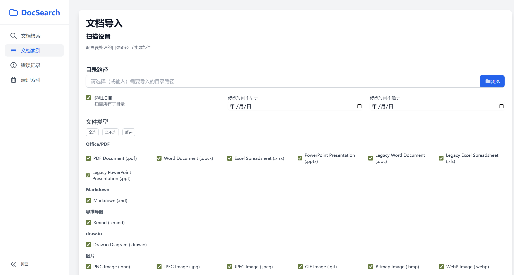
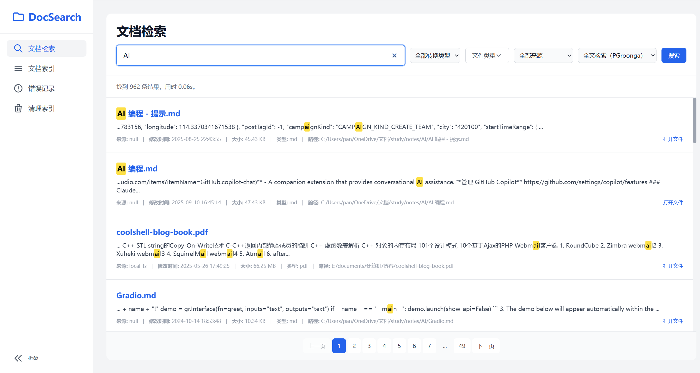
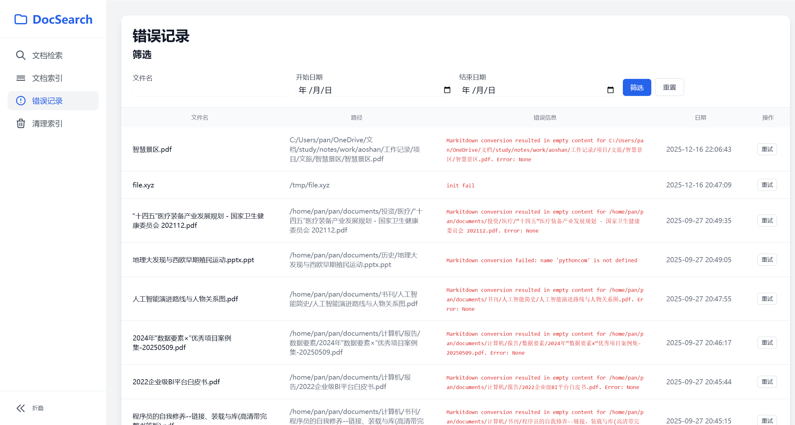

## 1. 项目概述

### 1.1 项目名称

本地文档搜索助手（Local Document Search）


### 1.2 项目背景

开发者和技术用户的本地硬盘中积累了大量文档，有 Markdown 笔记、PDF 报告、Word/Excel/PPT 文件、思维导图、流程图、网页存档等多种格式，但操作系统自带的搜索工具全文检索弱，以及不支持思维导图、流程图等文件格式，难以直接进行统一检索和使用。

另外随着本地 AI Agent 的兴起，如 OpenClaw、Claude Cowork，也需要用到本地文档，但需要为本地文档建立一个统一的知识库，并对其提供 CLI 接口使用。 


### 1.3 项目目标

本项目旨在构建一个**本地运行、隐私安全**的文档搜索助手，提供 Web UI 和 CLI 双入口，用户通过关键词快速定位文档，提供文档内容预览，并可以打开原始文档。


目标：

- 为个人开发者 / 研究者提供本地单机使用方案
- 支持 Markdown(`.md`)、PDF(`.pdf`) 、Word (`.docx`, `.doc` ) 、PPT(`.pptx`, `.ppt`)  、Excel (`.xlsx` , `.xls`)、思维导图 (`.xmind`)、流程图 (`.drawio`)、网页存档 (`.html`)、图片、视频等格式的索引与检索，其中图片、视频仅支持元数据的索引和检索，内容 OCR/转录留 v2.0
- 提供文档索引、文档检索、索引错误记录、索引清理的 Web 界面
- CLI 是一等公民，所有核心功能要有可用的 CLI 命令
- 提供文档内容预览（Markdown 渲染）与打开原始文件的能力
- 提供机器可读的 JSON 输出，支持 AI Agent 自动化集成
- 预留语义搜索（向量嵌入）扩展接口，当前版本仅实现关键词检索（模糊匹配、全文检索）


## 2. 目标用户与使用场景

### 2.1 目标用户

| 用户类型 | 典型画像 | 核心诉求 |
|---------|---------|---------|
| 个人开发者 / 研究者 | 本地积累大量技术文档、笔记、论文 | 快速定位内容，无需逐一打开文件 |
| AI Agent | 通过 CLI 自动化索引、查询文档 | 命令行接口稳定、输出机器可读（JSON） |


### 2.2 核心使用场景

| 场景                                                         | 用户动作                     | 期望结果                                                     |
| ------------------------------------------------------------ | ---------------------------- | ------------------------------------------------------------ |
| 查找自己做的笔记                                             | 搜索 Markdown 中的技术关键词 | 高亮显示关键词所在段落，点击可以预览文件，点击打开文件按钮可以打开原始文件 |
| 找半年前下载的 PDF 论文                                      | 搜索论文中的技术术语         | 高亮显示关键词所在段落，点击可以预览文件，点击打开文件按钮可以打开原始文件 |
| AI Agent（如OpenClaw、Claude Cowork） 通过 CLI 查询，获得命中文档列表、路径、元数据和文本片段 | 在 AI Agent 中对话           | 返回候选文档与片段                                           |


### 2.3 核心用户流程

#### 2.3.1 首次使用流程

1. 用户启动应用
2. 系统显示空状态页，引导添加索引目录
3. 用户选择一个本地目录
4. 系统开始扫描并建立索引（跳过未修改的文件）
5. 索引完成后，用户输入关键词
6. 系统展示搜索结果
7. 用户查看命中片段并打开原始文件


#### 2.3.2 后续使用流程

1. 用户打开应用
2. 用户输入关键词进行搜索
3. 系统展示匹配结果
4. 用户查看结果详情
5. 用户打开文件或打开所在目录


## 3. 功能需求

### 3.1 文档索引

#### **功能说明**

提供一个 Web 页面，用户可以通过该页面选择一个本地文件夹，并指定筛选条件，应用扫描找到符合筛选条件的文件，将其内容转换为Markdown格式，并存储到数据库中。


**扫描筛选条件：**

- 是否递归扫描子文件夹，默认勾选
- 修改时间的范围，默认为空
- 文件类型，默认全选


#### 页面设计

**页面入口：** 首页 / 左侧导航 / 文档索引

**页面布局：**见如下图片




**关键交互：**

点击「浏览」：弹出系统文件夹选择器，选择文件夹


### 3.2 文档检索

#### 功能说明

提供一个Web页面，用户可以通过关键词搜索数据库中已转换的Markdown内容。搜索结果应分页显示，并提供预览功能和原始文件链接。


**检索方式：**

支持单关键词、多关键词（空格分隔，默认 AND 逻辑）


#### 页面设计

**页面入口：**首页 / 左侧导航 / 文档检索

**页面布局：**见如下图片




**关键交互：**

- 搜索框自动获取焦点（页面加载时）
- 按 Enter 键或点解“搜索”触发
- 点击最近搜索词：自动填入搜索框并触发搜索


### 3.3 索引错误记录

#### 功能说明

1. 系统应提供失败记录页面，支持按文件名和更新时间范围过滤失败文档。
2. 系统应支持对失败文档执行“重试转换”。
3. 若重试成功，系统应更新 Markdown 内容、转换类型、状态和错误信息。
4. 若重试失败，系统应继续保留失败状态和最新错误信息。


#### 页面设计

**页面入口：** 首页 / 左侧导航 / 错误记录

**页面布局：**见如下图片




### 3.4 清理索引

#### 功能说明

- 系统应提供孤儿记录清理页面。
- 用户输入目录后，系统应识别该目录下数据库中存在但文件系统中已不存在的文档记录。
- 系统应支持按文件类型和路径关键词进一步筛选孤儿记录。
- 系统应支持批量删除选中的孤儿记录。


#### 页面设计

**页面入口：** 首页 / 左侧导航 / 清理索引

**页面布局：**见如下图片


### 3.5 CLI 功能

#### 功能说明

所有核心功能必须先有可用的 CLI 命令，Web UI 对应功能可延后实现。所有命令必须支持 `--help`、`--format json`、`--verbose` / `--quiet`。


**命令示例：**

| 命令                     | 参数                                         | 说明         |
| ------------------------ | -------------------------------------------- | ------------ |
| `doc-cli index <path>`   | `--recursive`、`--since`、`--type`           | 索引指定目录 |
| `doc-cli search <query>` | `--format json`、`--format table`、`--limit` | 检索         |
| `doc-cli retry <id>`     | `--all-failed`                               | 重试失败记录 |
| `doc-cli clean <path>`   |                                              | 清理孤儿索引 |


**输出规范：**

- 使用 `rich` 库实现进度条、彩色输出、表格展示
- `--quiet`：只输出最终结果，无进度信息
- `--verbose`：输出每个文件的处理详情
- `--format json`：输出机器可读 JSON，适合管道处理
- `--format table`：输出 rich 表格（默认人类友好模式）


## 4. 技术栈

**技术栈：**

- 后端：Python 3.12 + Flask
- 前端：HTML5 + Vanilla JS + Tailwind CSS（CDN 引入）
- 数据库：SQLite（FTS5 + Native Trigram）、PostgreSQL（PGroonga + pg_trgm）
- ORM：SQLAlchemy
- CLI：Typer
- 文件转换：markitdown
- 配置管理：python-dotenv
- 依赖管理：uv
- 代码格式和风格：Ruff
- 类型检查：Pyright
- 测试框架：pytest


## 5. 系统架构

### 5.1 整体架构图

```
┌──────────────────────────────────────────────────────────┐
│                       入口层                              │
│   CLI ( doc-cli.py)  │  Web UI (浏览器)            		 │
└────────────────┬──────────────┴────────────┬─────────────┘
                 │                           │
                 ▼                           ▼
┌──────────────────────────────────────────────────────────┐
│                   应用 / API 层                           │
│   CLI Commands (cli.py)  │  Flask Routes (routes/)       │
└────────────────┬─────────────────────────────────────────┘
                 │（共享 Service 层）
                 ▼
┌──────────────────────────────────────────────────────────┐
│                    业务 Service 层                        │
│   IndexService    │  SearchService    │  DocumentService │
└────────┬──────────┴─────────┬─────────┴──────────────────┘
         │                    │
         ▼                    ▼
┌──────────────────────────────────────────────────────────┐
│                  转换层 / 数据层                          │
│   ConverterFactory          │  SQLAlchemy ORM            │
│   ├── MarkItDown (pdf/docx/ │  models.py                 │
│   │   pptx/xlsx/html/md)    │  SQLite FTS5               │
│   ├── XMindConverter        │  data/search.db            │
│   ├── DrawioConverter       │                            │
└──────────────────────────────────────────────────────────┘
```


### 5.2 分层架构说明

| 层级   | 组件                                                 | 职责                                           |
| ------ | ---------------------------------------------------- | ---------------------------------------------- |
| 入口层 | CLI (Typer) / Flask Routes                           | 解析用户输入，调用 Service，格式化输出         |
| 业务层 | `IndexService` / `SearchService` / `DocumentService` | 核心业务逻辑，独立于入口，可被 CLI 和 Web 共用 |
| 转换层 | `ConverterFactory` + 各 Converter                    | 将不同格式文件转换为统一的 Markdown            |
| 数据层 | SQLAlchemy ORM + SQLite FTS5                         | 统一数据访问，屏蔽数据库细节                   |
| 工具层 | `utils/`                                             | 日志、文件工具、哈希计算等辅助函数             |


### 5.3 关键设计决策

**决策 1：CLI 优先**

- 所有核心功能先在 CLI 中实现，Web UI 通过调用相同的 Service 层复用逻辑
- CLI 入口为 `doc-cli.py`，通过 `uv run doc-cli.py` 执行

**决策 2：统一 Markdown 存储**

- 所有格式统一转换为 Markdown 后存入 `content_markdown` 字段
- 全文检索基于 Markdown 文本，避免多格式检索的复杂性
- 前端预览直接渲染 Markdown，用户体验一致

**决策 3：SQLite 作为默认数据库**

- 零外部依赖，用户开箱即用
- FTS5 + trigram tokenizer 支持子串匹配
- 通过 `DATABASE_URL` 环境变量支持将来扩展到 PostgreSQL

**决策 4：SearchService 抽象**

- `SearchService` 内部根据 `DATABASE_URL` 判断后端类型
- v1.0 仅需实现 `SQLiteSearchBackend`，PostgreSQL 的抽象接口定义留 v2.0 补充。
- 统一返回 `SearchResult` 列表，业务层透明


## 6. 数据模型

### **6.1 ingest_state（同步状态表）**

用于记录某个来源 (`source`) 在某个作用域 (`scope_key`) 下的最近一次导入状态，主要服务于增量导入、任务统计和错误诊断。

| 字段名               | 类型         | 必填 | 说明                                                         |
| -------------------- | ------------ | ---- | ------------------------------------------------------------ |
| `id`                 | `Integer`    | 是   | 主键，自增 ID。                                              |
| `source`             | `String(30)` | 是   | 数据来源标识。当前本地目录导入使用本地文件系统来源 fs，Joplin 脚本使用 joplin 来源。 |
| `scope_key`          | `Text`       | 是   | 来源作用域唯一键。对于本地文件导入通常是目录路径；对于 Joplin 导入通常是固定来源名 joplin 。 |
| `last_started_at`    | `TIMESTAMP`  | 否   | 最近一次导入开始时间。                                       |
| `last_ended_at`      | `TIMESTAMP`  | 否   | 最近一次导入结束时间。                                       |
| `last_error_message` | `Text`       | 否   | 最近一次导入任务级错误信息；单文件错误不写这里，而写入 `documents.error_message`。 |
| `cursor_updated_at`  | `TIMESTAMP`  | 否   | 增量导入游标时间。未显式传 `date_from` 时，系统应优先使用该值作为下次扫描起点。 |
| `total_files`        | `Integer`    | 否   | 最近一次导入扫描到的文件总数。                               |
| `processed`          | `Integer`    | 否   | 最近一次导入成功处理并写库的文件数。                         |
| `skipped`            | `Integer`    | 否   | 最近一次导入中因未变化、过滤条件或其他跳过原因未处理的文件数。 |
| `errors`             | `Integer`    | 否   | 最近一次导入中失败文件数。                                   |
| last_status          | `String(10)` |      | 最近一次导入状态：`running`、`success`、`failed`、`cancelled` |
| `created_at`         | `TIMESTAMP`  | 否   | 记录创建时间，默认 `now()`。                                 |
| `updated_at`         | `TIMESTAMP`  | 否   | 记录更新时间，由应用层更新。                                 |

约束与索引：

1. 主键：`id`。
2. 唯一索引：`idx_ingest_state_source_scope(source, scope_key)`。
3. 同一个 `source + scope_key` 在数据库中只能存在一条记录；导入任务应更新该记录，而不是重复插入。

实现约定：

1. 本地目录导入时，`scope_key` 应使用目录路径，以支持目录级增量同步。
2. 成功完成一次导入后，系统应将 `cursor_updated_at` 更新为本次任务开始时间 `start_time`，而不是结束时间。
3. 任务开始前应清空 `last_error_message`；任务失败时应回写最新错误。
4. `total_files / processed / skipped / errors` 表示最近一次任务汇总，不是历史累计值。


### **6.2 documents（文档记录表）**

用于保存单个文档或媒体文件的标准化索引记录，是搜索、预览、失败重试和打开原文件的核心数据表。

| 字段名               | 类型          | 必填 | 说明                                                    |
| -------------------- | ------------- | ---- | ------------------------------------------------------- |
| `id`                 | `Integer`     | 是   | 主键，自增 ID。                                         |
| `file_name`          | `String(200)` | 是   | 文件名，含扩展名。用于列表展示和文件名检索。            |
| `file_type`          | `String(10)`  | 否   | 文件扩展名或归一化类型，如 `md`、`pdf`、`png`。         |
| `file_size`          | `BigInteger`  | 否   | 文件大小，单位字节。                                    |
| `file_created_at`    | `TIMESTAMP`   | 否   | 文件创建时间。                                          |
| `file_modified_time` | `TIMESTAMP`   | 否   | 文件最后修改时间；增量跳过逻辑依赖该值。                |
| `file_path`          | `Text`        | 是   | 文件标准化绝对路径，全库唯一。                          |
| `content_markdown`   | `Text`        | 否   | 转换后的 Markdown 内容；失败记录可为空。                |
| `conversion_type`    | `Integer`     | 否   | 转换方式枚举值，见下方定义。                            |
| `status`             | `String(10)`  | 否   | 转换状态：`pending`、`completed`、`failed`、`skipped`。 |
| `error_message`      | `Text`        | 否   | 单文件转换失败原因；成功时通常为 `NULL`。               |
| `source`             | `String(30)`  | 否   | 数据来源标识，用于区分本地文件、Joplin 或未来扩展来源。 |
| `source_url`         | `Text`        | 否   | 来源 URL；本地文件通常为空，外部来源可保存原始链接。    |
| `created_at`         | `TIMESTAMP`   | 否   | 记录创建时间，默认 `now()`。                            |
| `updated_at`         | `TIMESTAMP`   | 否   | 记录更新时间，由应用层更新。                            |

约束与索引：

1. 主键：`id`。
2. 唯一约束：`file_path` 唯一。
3. 唯一索引：`idx_documents_file_path(file_path)`。

`conversion_type` 枚举定义：

1. `1 = DIRECT`：Markdown 直接读取。
2. `2 = STRUCTURED_TO_MD`：PDF / Office 等结构化文档通过统一流程转换为 Markdown。
3. `3 = XMIND_TO_MD`：XMind 转 Markdown。
4. `4 = DRAWIO_TO_MD`：draw.io 转 Markdown。
5. `5 = HTML_TO_MD`：HTML 单独转换为 Markdown。
6. `6 = IMAGE_METADATA_TO_MD`：图片 OCR 或图片描述转 Markdown。
7. `7 = VIDEO_METADATA_TO_MD`：音视频元数据或转录结果转 Markdown。

实现约定：

1. 记录唯一性以 `file_path` 为准，不以 `file_name` 为准。
2. 当 `file_path` 相同且 `file_modified_time` 未变化时，系统应跳过重复转换。
3. 转换失败时仍应保留或更新该记录，并写入 `status='failed'` 与 `error_message`，而不是删除记录。
4. 重试成功后应覆盖 `content_markdown`、`conversion_type`、`status` 和 `error_message`。
5. `source` 与 `source_url` 必须保留，供多来源导入扩展使用。


## 7. 非功能需求

### 7.1 可维护性需求

#### 7.1.1 代码质量

- Ruff 格式化 + Pyright 类型检查通过才可提交和合入主分支

#### 7.1.2 日志

- **日志输出：**同时写入文件和控制台
- **格式：**`"%(asctime)s %(levelname)-8s %(name)s:%(lineno)d %(message)s"`
- **日志文件轮转:：** 按日期分割

#### 7.1.3 文档完整性

- `README.md`：项目介绍、安装和使用说明
- `AGENTS.md`：面向 AI Coding Agent 提供引导、约束说明和开发规范


### 7.2 兼容性

- **操作系统：** Windows 11+、Ubuntu 22.04+、macOS 15+
- **Python 版本：**Python 3.12+


## 8. 项目结构


```markdown
local-document-search/
├── src/
│   └── local_document_search/  # 源代码根目录
│       ├── routes/             # 路由蓝图（视图函数）
│       ├── services/           # 核心业务逻辑
│       │   ├── index_service.py        # 索引（扫描、写库、增量跳过）
│       │   ├── search_service.py       # 检索
│       │   ├── error_record_service.py # 错误记录查询、重试
│       │   ├── clean_service.py        # 孤儿记录扫描、删除
│       │   ├── document_service.py     # 文档预览
│       │   └── file_opener_service.py  # 打开原始文件
│       ├── converters/         # 文件格式转换层
│       │   ├── __init__.py     # ConverterFactory（含扩展名映射与选择逻辑）
│       │   ├── base.py         # BaseConverter 抽象类
│       │   ├── markitdown.py   # MarkItDownConverter
│       │   ├── xmind.py        # XMindConverter
│       │   └── drawio.py       # DrawioConverter
│       ├── persistence/        # 数据访问层
│       │   ├── database.py     # engine、SessionLocal、Base、FTS5 初始化
│       │   ├── repositories/   # ORM 操作封装（每张表一个 repository）
│       │   │   ├── document_repository.py     # documents 表的增删改查
│       │   │   └── ingest_state_repository.py # ingest_state 表的增删改查
│       │   └── search/         # 搜索后端抽象
│       │       ├── base.py         # SearchBackend 抽象基类
│       │       └── sqlite_backend.py # SQLiteSearchBackend（FTS5 实现）
│       ├── static/             # 静态文件
│       ├── templates/          # HTML 模板
│       ├── utils/              # 辅助工具函数
│       ├── __init__.py         # 应用工厂函数
│       ├── cli.py              # Typer 命令定义模块
│       ├── models.py           # ORM 类定义（import Base from persistence.database）
│       └── config.py           # 配置文件
├── data/                       # 数据目录（SQLite 文件，含 .gitkeep）
├── docs/                       # 项目文档
├── logs/                       # 运行日志（含 .gitkeep）
├── scripts/                    # 辅助脚本
├── tests/                      # 测试
│   ├── unit/                   # 单元测试
│   ├── integration/            # 集成测试
│   ├── e2e/                    # 端到端测试
│   ├── fixtures/               # 小样本文档
│   └── conftest.py             # pytest 配置文件
├── .env                        # 环境变量（需从 .env.example 复制创建）
├── .env.example                # 环境变量模板
├── pyproject.toml              # 项目配置与依赖管理，不配置 scripts 入口
├── AGENTS.md                   # 面向 AI Coding Agent 的引导、约束说明文档
├── README.md                   # README
├── doc-cli.py                  # CLI 入口（唯一的 CLI 入口，import cli.py）
└── run.py                      # 应用启动入口
```


## 9. 里程碑

### 9.1 里程碑

#### M0 项目骨架

交付：

- `pyproject.toml`
- 基础目录结构
- 配置加载
- 日志配置
- `db init`

验收命令：

```bash
uv run doc-cli.py db init
```


#### M1 最小索引链路

交付：

- `MarkdownConverter`
- `TextConverter`
- `ConverterFactory`
- `IndexService`
- `index` 命令

验收命令：

```bash
uv run doc-cli.py index tests/fixtures
```


#### M2  办公文档接入与检索

交付：

- `MarkItDownConverter`
- `SearchService`
- SQLite FTS5 检索

验收命令：

```bash
uv run doc-cli.py search "sample"
uv run doc-cli.py search "sample" --format json
```


## 10. 验收标准

### 10.1 成功指标

| 指标       | 目标值                       | 衡量方式   |
| ---------- | ---------------------------- | ---------- |
| 测试覆盖率 | 核心 Service 层 ≥ 60%        | pytest-cov |
| CLI 覆盖率 | 关键 CLI 流程必须有 E2E 测试 | E2E 测试   |


### 10.2 Done Definition（每个里程碑都必须满足）

每个里程碑完成时，必须同时满足：

1. 功能代码已落地
2. 对应命令可运行
3. 自动化测试通过
4. README 或相应文档已更新
5. 不引入与本里程碑无关的大范围抽象


## 11. 约束与边界

### 11.1 v1.0 明确不做

- ❌ 语义搜索 / 向量检索（预留接口，留 v2.0）
- ❌ 图片 OCR 文字识别（留 P2）
- ❌ 视频字幕 / ASR 转文字（留 P2）
- ❌ 用户账号体系（单机本地工具）
- ❌ Docker 容器化
- ❌ 云同步 / 多设备
- ❌ 文件编辑功能（只读搜索）
- ❌ Electron / Tauri 桌面 App 封装
- ❌ PostgreSQL 支持（v1.0 仅支持 SQLite，v2.0 支持 PostgreSQL ）


### 11.2 已知限制

- 加密 PDF 无法提取文本，记录为 `skipped` 状态
- SQLite 支持单写多读，满足本地单用户 / 小团队场景；高并发写场景需迁移 PostgreSQL
- N-Gram trigram 分词可能导致短词（1-2 字）检索精度下降，建议搜索时输入 3 字以上关键词


## 12. 附录

### 12.1 术语表

| 术语            | 说明                                           |
| --------------- | ---------------------------------------------- |
| Scope Out       | 明确排除在本版本范围之外的功能                 |
| Toast           | 页面底部或顶部短暂出现后自动消失的轻量提示信息 |
| AI Coding Agent | AI 编程智能体，如 Claude Code、Codex           |


### 12.2 文档格式支持

> 所有文档均通过 `MarkItDown` 库或自研 Converter 转换为 Markdown 后存储，以统一全文检索接口。图片、视频仅提取文件名、创建日期、修改日期、文件格式、文件大小等元数据

| 格式       | 扩展名                            | 所属类型 |
| ---------- | --------------------------------- | -------- |
| Markdown   | `.md`                             | Markdown |
| PDF        | `.pdf`                            | PDF      |
| Word       | `.docx`, `.doc`                   | Office   |
| PowerPoint | `.pptx`, `.ppt`                   | Office   |
| Excel      | `.xlsx`, `.xls`                   | Office   |
| 网页存档   | `.html`, `.htm`                   | HTML     |
| 思维导图   | `.xmind`                          | 思维导图 |
| 流程图     | `.drawio`                         | 流程图   |
| 图片       | `.jpg/.jpeg/.png/.gif/.webp/.svg` | 图片     |
| 视频       | `.mp4/.mov/.avi/.mkv`             | 视频     |

